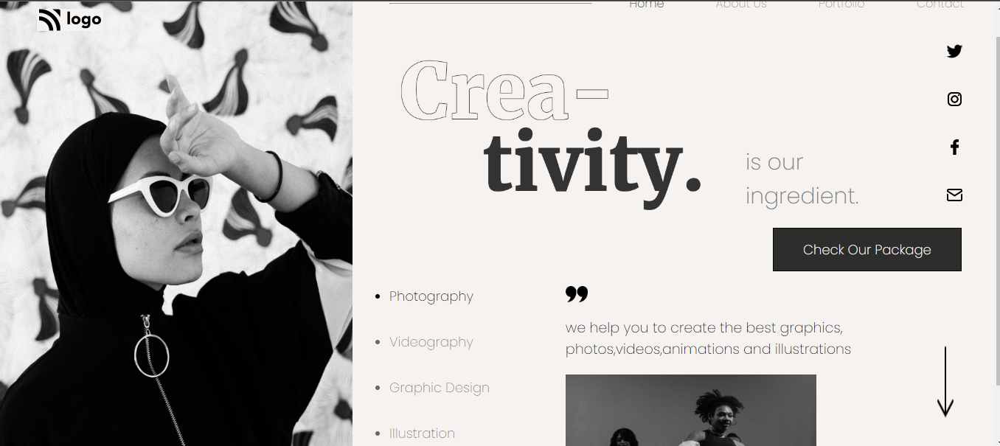

# Project 14: Dance Home Page using HTML  and CSS 

Chandrakala P

## Final Look of the Webpage:

### Live project Link:

[project link](https://dance-landing-page-project14.netlify.app/)

## What I learnt from this Project?

- This project helped me to understand the whole idea of Html and css.
- I learnt most of the basics tags in html and many properties in css.
- It helped me to understand more about css selectors and more other CSS properties.
- This project helped me to understand background-img and bgc, buttons, text-transform, text-decoration and many more properties in css and also positioning and transform property in css and many more.

## Stacks and Tools:

- HTML and CSS
- HTML : list, p, div, li, ul, ol, heading tags, button, img, section and many more.
- CSS: margin, padding, bgc, color, posiiton text-decorations align items, display, flex, text align, justify content, gap, bgi, border, border-radius, transform etc.
